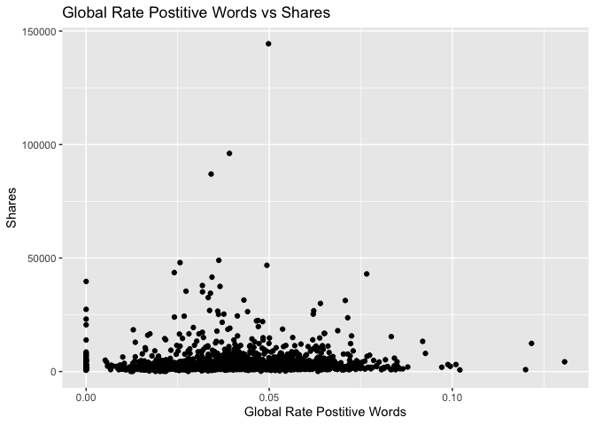
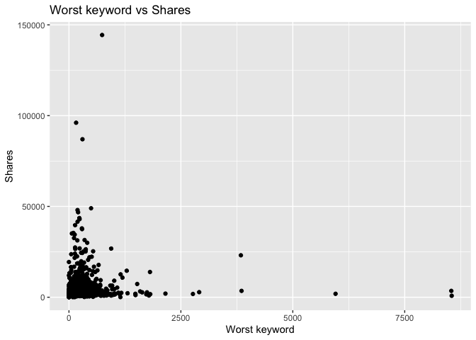

Project 2
================
Yuying Zhou
10/12/2020

  - [Package List](#package-list)
  - [Introduction](#introduction)
  - [Data](#data)
  - [Summarizations](#summarizations)
  - [Secondary Analysis (forked by Kolton
    Wiebusch)](#secondary-analysis-forked-by-kolton-wiebusch)
  - [Automation](#automation)

# Package List

``` r
library(tidyverse)
library(caret)
library(knitr)
library(rmarkdown)
```

# Introduction

The data analyzed in the project is a heterogeneous set of features
about articles published by Mashable in a period of two years. It
includes 61 variables. The response varialbe is share. The purpose of
this project is to build two models- a tree-based model and a boosted
tree model- to see which model performs better at predicting the number
of shares in social networks. This data set include data for Monday to
Sunday, the analysis conducted the same analysis for each day and to see
which model suit them.

This analysis did not include all of the predicators. I used the
following

  - n\_unique\_tokens: Rate of unique words in the content  
  - num\_hrefs: Number of links  
  - num\_imgs: Number of images  
  - average\_token\_length: Average length of the words in the content  
  - data\_channel\_is\_lifestyle: Is data channel ‘Lifestyle’?  
  - global\_rate\_positive\_words: Rate of positive words in the
    content  
  - avg\_positive\_polarity: Avg. polarity of positive words  
  - abs\_title\_subjectivity: Absolute subjectivity level  
  - self\_reference\_avg\_sharess: Avg. shares of referenced articles in
    Mashable  
  - kw\_avg\_min: Worst keyword (avg. shares)  
  - kw\_avg\_max: Best keyword (avg. shares)  
  - kw\_avg\_avg: Avg. keyword (avg. shares)
  - shares: Number of shares (target)

Additionally, I included the variables weekday\_is\_\* in the dataset
for generating a seperate report for each weekday.

``` r
Data<-read_csv("OnlineNewsPopularity.csv")
Data<-Data%>%select(n_unique_tokens,num_hrefs, num_imgs, average_token_length, data_channel_is_lifestyle, global_rate_positive_words,avg_positive_polarity, abs_title_subjectivity,self_reference_avg_sharess, kw_avg_min, kw_avg_max, kw_avg_avg, shares, starts_with("weekday") )
Data<-gather(Data, weekday, weekdayvalue,14:20) %>% filter(weekdayvalue==1)
```

# Data

I read data from the folder and then split daily data set into train and
test set. The train set include 70% of the data and the test set include
30% of the data. The date was filter to only include values for
weekday\_is\_saturday

``` r
dayData<-Data%>%filter(weekday==params$weekday)%>%select(-c(weekday,weekdayvalue))
print(params$weekday)
```

    ## [1] "weekday_is_saturday"

``` r
set.seed(1)

train <- sample(1:nrow(dayData), size = nrow(dayData)*0.7)
test <- dplyr::setdiff(1:nrow(dayData), train)
dayDataTrain <- dayData[train, ]
dayDataTest <- dayData[test, ]
```

# Summarizations

Based on the summary table, no missing values. As shown in the histogram
for shares, most articles had zero shares. According to the correlation
table, mullinearity is not an issue for the data set. There isn’t much
variations as the global rate positive words change.

``` r
summary(dayDataTrain)  
```

    ##  n_unique_tokens    num_hrefs         num_imgs      average_token_length data_channel_is_lifestyle
    ##  Min.   :0.0000   Min.   :  0.00   Min.   : 0.000   Min.   :0.000        Min.   :0.0000           
    ##  1st Qu.:0.4595   1st Qu.:  5.00   1st Qu.: 1.000   1st Qu.:4.475        1st Qu.:0.0000           
    ##  Median :0.5199   Median : 10.00   Median : 1.000   Median :4.666        Median :0.0000           
    ##  Mean   :0.5112   Mean   : 13.03   Mean   : 5.411   Mean   :4.507        Mean   :0.0728           
    ##  3rd Qu.:0.5927   3rd Qu.: 17.00   3rd Qu.: 8.000   3rd Qu.:4.855        3rd Qu.:0.0000           
    ##  Max.   :0.9574   Max.   :105.00   Max.   :99.000   Max.   :6.295        Max.   :1.0000           
    ##  global_rate_positive_words avg_positive_polarity abs_title_subjectivity self_reference_avg_sharess
    ##  Min.   :0.00000            Min.   :0.0000        Min.   :0.0000         Min.   :     0            
    ##  1st Qu.:0.02825            1st Qu.:0.3126        1st Qu.:0.1250         1st Qu.:  1000            
    ##  Median :0.04040            Median :0.3659        Median :0.4500         Median :  2350            
    ##  Mean   :0.04063            Mean   :0.3567        Mean   :0.3276         Mean   :  6087            
    ##  3rd Qu.:0.05263            3rd Qu.:0.4167        3rd Qu.:0.5000         3rd Qu.:  5200            
    ##  Max.   :0.13065            Max.   :1.0000        Max.   :0.5000         Max.   :663600            
    ##    kw_avg_min       kw_avg_max       kw_avg_avg        shares      
    ##  Min.   :  -1.0   Min.   :  7178   Min.   : 1115   Min.   :    49  
    ##  1st Qu.: 142.8   1st Qu.:170944   1st Qu.: 2505   1st Qu.:  1400  
    ##  Median : 244.1   Median :239888   Median : 3045   Median :  2000  
    ##  Mean   : 302.4   Mean   :250369   Mean   : 3300   Mean   :  3806  
    ##  3rd Qu.: 362.9   3rd Qu.:315360   3rd Qu.: 3839   3rd Qu.:  3700  
    ##  Max.   :8549.3   Max.   :843300   Max.   :36717   Max.   :144400

``` r
res<-cor(dayDataTrain)
tab<-round(res,2)
kable(tab, caption = "Correlation Table for the Train Data")
```

|                               | n\_unique\_tokens | num\_hrefs | num\_imgs | average\_token\_length | data\_channel\_is\_lifestyle | global\_rate\_positive\_words | avg\_positive\_polarity | abs\_title\_subjectivity | self\_reference\_avg\_sharess | kw\_avg\_min | kw\_avg\_max | kw\_avg\_avg | shares |
| :---------------------------- | ----------------: | ---------: | --------: | ---------------------: | ---------------------------: | ----------------------------: | ----------------------: | -----------------------: | ----------------------------: | -----------: | -----------: | -----------: | -----: |
| n\_unique\_tokens             |              1.00 |     \-0.04 |    \-0.20 |                   0.72 |                         0.03 |                          0.31 |                    0.47 |                     0.09 |                          0.06 |       \-0.01 |       \-0.02 |         0.00 |   0.04 |
| num\_hrefs                    |            \-0.04 |       1.00 |      0.29 |                   0.25 |                         0.06 |                          0.14 |                    0.25 |                     0.03 |                          0.05 |         0.04 |       \-0.03 |         0.10 |   0.03 |
| num\_imgs                     |            \-0.20 |       0.29 |      1.00 |                   0.02 |                         0.03 |                        \-0.03 |                    0.11 |                   \-0.06 |                          0.02 |         0.00 |         0.01 |         0.13 |   0.02 |
| average\_token\_length        |              0.72 |       0.25 |      0.02 |                   1.00 |                         0.01 |                          0.36 |                    0.61 |                     0.13 |                          0.06 |       \-0.01 |       \-0.05 |       \-0.06 | \-0.01 |
| data\_channel\_is\_lifestyle  |              0.03 |       0.06 |      0.03 |                   0.01 |                         1.00 |                          0.08 |                    0.12 |                     0.02 |                        \-0.02 |         0.01 |       \-0.08 |         0.10 |   0.01 |
| global\_rate\_positive\_words |              0.31 |       0.14 |    \-0.03 |                   0.36 |                         0.08 |                          1.00 |                    0.44 |                   \-0.11 |                          0.02 |         0.07 |       \-0.09 |         0.01 |   0.02 |
| avg\_positive\_polarity       |              0.47 |       0.25 |      0.11 |                   0.61 |                         0.12 |                          0.44 |                    1.00 |                     0.06 |                          0.04 |         0.00 |         0.00 |         0.08 |   0.04 |
| abs\_title\_subjectivity      |              0.09 |       0.03 |    \-0.06 |                   0.13 |                         0.02 |                        \-0.11 |                    0.06 |                     1.00 |                          0.02 |         0.04 |       \-0.04 |       \-0.01 |   0.05 |
| self\_reference\_avg\_sharess |              0.06 |       0.05 |      0.02 |                   0.06 |                       \-0.02 |                          0.02 |                    0.04 |                     0.02 |                          1.00 |         0.01 |         0.06 |         0.11 |   0.03 |
| kw\_avg\_min                  |            \-0.01 |       0.04 |      0.00 |                 \-0.01 |                         0.01 |                          0.07 |                    0.00 |                     0.04 |                          0.01 |         1.00 |       \-0.22 |         0.22 |   0.03 |
| kw\_avg\_max                  |            \-0.02 |     \-0.03 |      0.01 |                 \-0.05 |                       \-0.08 |                        \-0.09 |                    0.00 |                   \-0.04 |                          0.06 |       \-0.22 |         1.00 |         0.31 | \-0.03 |
| kw\_avg\_avg                  |              0.00 |       0.10 |      0.13 |                 \-0.06 |                         0.10 |                          0.01 |                    0.08 |                   \-0.01 |                          0.11 |         0.22 |         0.31 |         1.00 |   0.11 |
| shares                        |              0.04 |       0.03 |      0.02 |                 \-0.01 |                         0.01 |                          0.02 |                    0.04 |                     0.05 |                          0.03 |         0.03 |       \-0.03 |         0.11 |   1.00 |

Correlation Table for the Train Data

``` r
g<-ggplot(dayDataTrain,aes(x=shares))
g+geom_histogram(binwidth = 100000)+labs(x="Shares", y="Count", title = "Shares Histogram")
```

<!-- -->

``` r
g2<-ggplot(dayDataTrain, aes(x=global_rate_positive_words, y=shares))
g2+geom_jitter()+labs(x="Global Rate Postitive Words", y="Shares", title="Global Rate Postitive Words vs Shares")
```

<!-- -->

``` r
g3<-ggplot(dayDataTrain, aes(x=kw_avg_min, y=shares))
g3+geom_jitter()+labs(x="Worst keyword", y="Shares", title="Worst keyword vs Shares")
```

<!-- --> \#
Models  
This step will create two models. One is a regression tree model and the
second one is a boosted tree model. Both models include all predictors
included in the data set. The tuning paramter “cp” for the regression
tree model was chosen using the leave one out cross validation. I picked
the best tree model using the smallest MAE. The boosted tree model used
cross-validation with 10 folds. The final chose model for the boosted
tree model was determined using the smallest MAE.

Once the optimal model was picked, I used the test data set to see which
model was better at predicting shares. The model with the smallest MAE
values was considered better at predicting.

The table below shows the RMSE, R-squared, MAE for these two models’
predictions using the test set.

``` r
tree_fit<-train(shares~., data=dayDataTrain, method="rpart",
                trControl=trainControl(method = "LOOCV"),
                preProcess = c("center", "scale"),
                tuneLength=10,
                metric="MAE")
plot(tree_fit)
```

<!-- -->

``` r
bt_fit<-train(shares~., data=dayDataTrain, method="gbm",
              preProcess = c("center", "scale"),
              trControl=trainControl(method="cv", number = 10),
              tuneGrid=expand.grid(n.trees=c(1,5,10), interaction.depth=1:3, shrinkage=c(0.1,0.5,0.9), n.minobsinnode=10),
              verbose = FALSE,
              metric="MAE")
plot(bt_fit)
```

<!-- -->

``` r
pred_tree<-predict(tree_fit, newdata = dayDataTest)   
pred_bt<-predict(bt_fit, newdata = dayDataTest)
pred_tree_metric<-postResample(pred_tree,obs = dayDataTest$shares)
pred_bt_metric<-postResample(pred_bt,obs = dayDataTest$shares)
Metric_Table<-data.frame(pred_tree_metric, pred_bt_metric)
kable(Metric_Table, caption = "Prediction Metric for Two Potential Models", col.names = c("Regressio Tree"," Boosted Tree"))
```

|          | Regressio Tree | Boosted Tree |
| :------- | -------------: | -----------: |
| RMSE     |   2.404628e+04 | 2.381091e+04 |
| Rsquared |   5.700000e-06 | 2.665300e-03 |
| MAE      |   4.358718e+03 | 4.017121e+03 |

Prediction Metric for Two Potential Models

# Secondary Analysis (forked by Kolton Wiebusch)

This step is to add a multiple linear regression model to fit the
training data, then test the model predictions on the test set.

``` r
linRegfit <- train(shares ~ ., data = dayDataTrain, method = "lm",
                   preProcess = c("center", "scale"),
                   trControl=trainControl(method="cv", number = 10, repeats = 5))
linRegfit
```

    ## Linear Regression 
    ## 
    ## 1717 samples
    ##   12 predictor
    ## 
    ## Pre-processing: centered (12), scaled (12) 
    ## Resampling: Cross-Validated (10 fold) 
    ## Summary of sample sizes: 1545, 1545, 1547, 1545, 1545, 1545, ... 
    ## Resampling results:
    ## 
    ##   RMSE      Rsquared    MAE     
    ##   6190.391  0.02329438  2950.674
    ## 
    ## Tuning parameter 'intercept' was held constant at a value of TRUE

``` r
pred_lm <- predict(linRegfit, newdata = dayDataTest)   
pred_lm_metric <- postResample(pred_lm, obs = dayDataTest$shares)
kable(pred_lm_metric)
```

|          |            x |
| :------- | -----------: |
| RMSE     | 2.382659e+04 |
| Rsquared | 1.623700e-03 |
| MAE      | 4.025629e+03 |

# Automation

First, I got unique weekday from the weekday column of the Data data set
using unique() function. And then, I created filenames. and put filename
for each day in a dateframe.

``` r
DayofWeek<-unique(Data$weekday)
render_one<-function(weekday){
  rmarkdown::render(
    "Project2.Rmd",output_file = paste0(weekday,".md"), params = list(weekday=weekday)
  )
}

for (weekday in DayofWeek){
  render_one(weekday)
}
```
