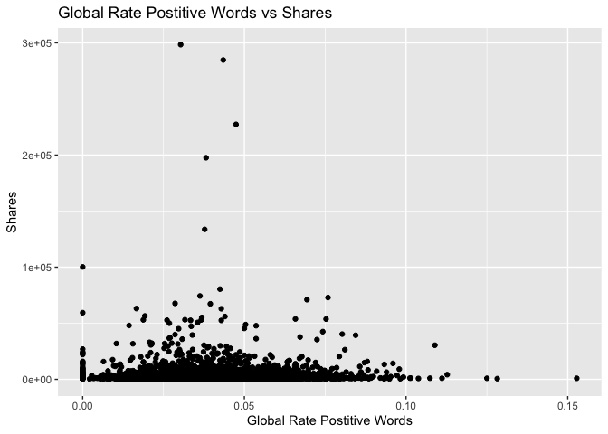

Project 2
================
Yuying Zhou
10/12/2020

  - [Package List](#package-list)
  - [Introduction](#introduction)
  - [Data](#data)
  - [Summarizations](#summarizations)
  - [Automation](#automation)

# Package List

``` r
library(tidyverse)
library(caret)
library(knitr)
library(rmarkdown)
```

# Introduction

The data analyzed in the project is a heterogeneous set of features
about articles published by Mashable in a period of two years. It
includes 61 variables. The response varialbe is share. The purpose of
this project is to build two models- a tree-based model and a boosted
tree model- to see which model performs better at predicting the number
of shares in social networks. This data set include data for Monday to
Sunday, the analysis conducted the same analysis for each day and to see
which model suit them.

This analysis did not include all of the predicators. I used the
following

  - n\_unique\_tokens: Rate of unique words in the content  
  - num\_hrefs: Number of links  
  - num\_imgs: Number of images  
  - average\_token\_length: Average length of the words in the content  
  - data\_channel\_is\_lifestyle: Is data channel ‘Lifestyle’?  
  - global\_rate\_positive\_words: Rate of positive words in the
    content  
  - avg\_positive\_polarity: Avg. polarity of positive words  
  - abs\_title\_subjectivity: Absolute subjectivity level  
  - self\_reference\_avg\_sharess: Avg. shares of referenced articles in
    Mashable  
  - kw\_avg\_min: Worst keyword (avg. shares)  
  - kw\_avg\_max: Best keyword (avg. shares)  
  - kw\_avg\_avg: Avg. keyword (avg. shares)
  - shares: Number of shares (target)

Additionally, I included the variables weekday\_is\_\* in the dataset
for generating a seperate report for each weekday.

``` r
Data<-read_csv("../OnlineNewsPopularity.csv")
Data<-Data%>%select(n_unique_tokens,num_hrefs, num_imgs, average_token_length, data_channel_is_lifestyle, global_rate_positive_words,avg_positive_polarity, abs_title_subjectivity,self_reference_avg_sharess, kw_avg_min, kw_avg_max, kw_avg_avg, shares, starts_with("weekday") )
Data<-gather(Data, weekday, weekdayvalue,14:20) %>% filter(weekdayvalue==1)
```

# Data

I read data from the folder and then split daily data set into train and
test set. The train set include 70% of the data and the test set include
30% of the data.

``` r
dayData<-Data%>%filter(weekday==params$weekday)%>%select(-c(weekday,weekdayvalue))

set.seed(1)

#try a subset
sub <- sample(1:nrow(dayData), size = nrow(dayData)*0.1)
dayData<-dayData[sub,]

train <- sample(1:nrow(dayData), size = nrow(dayData)*0.7)
test <- dplyr::setdiff(1:nrow(dayData), train)
dayDataTrain <- dayData[train, ]
dayDataTest <- dayData[test, ]
```

# Summarizations

Based on the summary table, no missing values. As shown in the histogram
for shares, most articles had zero shares. According to the correlation
table, mullinearity is not an issue for the data set. There isn’t much
variations as the global rate positive words change.

``` r
summary(dayDataTrain)  
```

    ##  n_unique_tokens    num_hrefs        num_imgs      average_token_length data_channel_is_lifestyle
    ##  Min.   :0.0000   Min.   : 0.00   Min.   : 0.000   Min.   :0.000        Min.   :0.00000          
    ##  1st Qu.:0.4691   1st Qu.: 4.00   1st Qu.: 1.000   1st Qu.:4.475        1st Qu.:0.00000          
    ##  Median :0.5379   Median : 7.00   Median : 1.000   Median :4.666        Median :0.00000          
    ##  Mean   :0.5265   Mean   :10.76   Mean   : 4.659   Mean   :4.500        Mean   :0.06299          
    ##  3rd Qu.:0.6191   3rd Qu.:13.00   3rd Qu.: 4.000   3rd Qu.:4.851        3rd Qu.:0.00000          
    ##  Max.   :0.9487   Max.   :89.00   Max.   :98.000   Max.   :5.377        Max.   :1.00000          
    ##  global_rate_positive_words avg_positive_polarity abs_title_subjectivity self_reference_avg_sharess
    ##  Min.   :0.00000            Min.   :0.0000        Min.   :0.0000         Min.   :     0.0          
    ##  1st Qu.:0.02816            1st Qu.:0.3033        1st Qu.:0.1511         1st Qu.:   959.5          
    ##  Median :0.03873            Median :0.3564        Median :0.4750         Median :  2222.9          
    ##  Mean   :0.03926            Mean   :0.3463        Mean   :0.3362         Mean   :  5664.7          
    ##  3rd Qu.:0.05013            3rd Qu.:0.4088        3rd Qu.:0.5000         3rd Qu.:  5200.0          
    ##  Max.   :0.12821            Max.   :0.6750        Max.   :0.5000         Max.   :332850.0          
    ##    kw_avg_min        kw_avg_max       kw_avg_avg         shares     
    ##  Min.   :   -1.0   Min.   :  7254   Min.   : 887.9   Min.   :   42  
    ##  1st Qu.:  142.5   1st Qu.:168121   1st Qu.:2439.8   1st Qu.:  942  
    ##  Median :  235.9   Median :252188   Median :2855.5   Median : 1400  
    ##  Mean   :  340.7   Mean   :263258   Mean   :3121.3   Mean   : 2908  
    ##  3rd Qu.:  365.5   3rd Qu.:340630   3rd Qu.:3596.1   3rd Qu.: 2500  
    ##  Max.   :13744.8   Max.   :843300   Max.   :9318.5   Max.   :52600

``` r
res<-cor(dayDataTrain)
tab<-round(res,2)
kable(tab, caption = "Correlation Table for the Train Data")
```

|                               | n\_unique\_tokens | num\_hrefs | num\_imgs | average\_token\_length | data\_channel\_is\_lifestyle | global\_rate\_positive\_words | avg\_positive\_polarity | abs\_title\_subjectivity | self\_reference\_avg\_sharess | kw\_avg\_min | kw\_avg\_max | kw\_avg\_avg | shares |
| :---------------------------- | ----------------: | ---------: | --------: | ---------------------: | ---------------------------: | ----------------------------: | ----------------------: | -----------------------: | ----------------------------: | -----------: | -----------: | -----------: | -----: |
| n\_unique\_tokens             |              1.00 |     \-0.09 |    \-0.27 |                   0.72 |                         0.05 |                          0.36 |                    0.44 |                     0.05 |                          0.01 |       \-0.07 |       \-0.07 |       \-0.10 |   0.07 |
| num\_hrefs                    |            \-0.09 |       1.00 |      0.30 |                   0.23 |                         0.01 |                          0.13 |                    0.28 |                   \-0.01 |                        \-0.02 |         0.07 |       \-0.06 |         0.13 |   0.09 |
| num\_imgs                     |            \-0.27 |       0.30 |      1.00 |                 \-0.01 |                       \-0.01 |                        \-0.01 |                    0.07 |                   \-0.06 |                          0.01 |         0.02 |         0.00 |         0.16 |   0.04 |
| average\_token\_length        |              0.72 |       0.23 |    \-0.01 |                   1.00 |                         0.04 |                          0.40 |                    0.61 |                     0.07 |                          0.04 |       \-0.04 |       \-0.16 |       \-0.21 |   0.05 |
| data\_channel\_is\_lifestyle  |              0.05 |       0.01 |    \-0.01 |                   0.04 |                         1.00 |                          0.09 |                    0.06 |                     0.02 |                        \-0.01 |         0.16 |       \-0.15 |         0.14 |   0.05 |
| global\_rate\_positive\_words |              0.36 |       0.13 |    \-0.01 |                   0.40 |                         0.09 |                          1.00 |                    0.45 |                   \-0.10 |                        \-0.04 |         0.00 |       \-0.15 |       \-0.07 |   0.01 |
| avg\_positive\_polarity       |              0.44 |       0.28 |      0.07 |                   0.61 |                         0.06 |                          0.45 |                    1.00 |                     0.09 |                          0.11 |         0.00 |       \-0.12 |       \-0.01 |   0.06 |
| abs\_title\_subjectivity      |              0.05 |     \-0.01 |    \-0.06 |                   0.07 |                         0.02 |                        \-0.10 |                    0.09 |                     1.00 |                          0.06 |       \-0.07 |       \-0.02 |       \-0.04 | \-0.07 |
| self\_reference\_avg\_sharess |              0.01 |     \-0.02 |      0.01 |                   0.04 |                       \-0.01 |                        \-0.04 |                    0.11 |                     0.06 |                          1.00 |       \-0.01 |         0.05 |         0.05 |   0.02 |
| kw\_avg\_min                  |            \-0.07 |       0.07 |      0.02 |                 \-0.04 |                         0.16 |                          0.00 |                    0.00 |                   \-0.07 |                        \-0.01 |         1.00 |       \-0.18 |         0.30 | \-0.03 |
| kw\_avg\_max                  |            \-0.07 |     \-0.06 |      0.00 |                 \-0.16 |                       \-0.15 |                        \-0.15 |                  \-0.12 |                   \-0.02 |                          0.05 |       \-0.18 |         1.00 |         0.43 |   0.03 |
| kw\_avg\_avg                  |            \-0.10 |       0.13 |      0.16 |                 \-0.21 |                         0.14 |                        \-0.07 |                  \-0.01 |                   \-0.04 |                          0.05 |         0.30 |         0.43 |         1.00 |   0.14 |
| shares                        |              0.07 |       0.09 |      0.04 |                   0.05 |                         0.05 |                          0.01 |                    0.06 |                   \-0.07 |                          0.02 |       \-0.03 |         0.03 |         0.14 |   1.00 |

Correlation Table for the Train Data

``` r
g<-ggplot(dayDataTrain,aes(x=shares))
g+geom_histogram(binwidth = 100000)+labs(x="Shares", y="Count", title = "Shares Histogram")
```

<!-- -->

``` r
g2<-ggplot(dayDataTrain, aes(x=global_rate_positive_words, y=shares))
g2+geom_jitter()+labs(x="Global Rate Postitive Words", y="Shares", title="Global Rate Postitive Words vs Shares")
```

<!-- --> \#
Models  
This step will create two models. One is a regression tree model and the
second one is a boosted tree model. Both models include all predictors
included in the data set. The tuning paramter “cp” for the regression
tree model was chosen using the leave one out cross validation. I picked
the best tree model using the smallest MAE. The boosted tree model used
cross-validation with 10 folds. The final chose model for the boosted
tree model was determined using the smallest MAE.

Once the optimal model was picked, I used the test data set to see which
model was better at predicting shares. The model with the smallest MAE
values was considered better at predicting.

The table below shows the RMSE, R-squared, MAE for these two models’
predictions using the test set.

``` r
tree_fit<-train(shares~., data=dayDataTrain, method="rpart",
                trControl=trainControl(method = "LOOCV"),
                preProcess = c("center", "scale"),
                tuneLength=10,
                metric="MAE")
plot(tree_fit)
```

<!-- -->

``` r
bt_fit<-train(shares~., data=dayDataTrain, method="gbm",
              preProcess = c("center", "scale"),
              trControl=trainControl(method="cv", number = 10),
              tuneGrid=expand.grid(n.trees=c(1,5,10), interaction.depth=1:3, shrinkage=c(0.1,0.5,0.9), n.minobsinnode=10),
              verbose = FALSE,
              metric="MAE")
plot(bt_fit)
```

<!-- -->

``` r
pred_tree<-predict(tree_fit, newdata = dayDataTest)   
pred_bt<-predict(bt_fit, newdata = dayDataTest)
pred_tree_metric<-postResample(pred_tree,obs = dayDataTest$shares)
pred_bt_metric<-postResample(pred_bt,obs = dayDataTest$shares)
Metric_Table<-data.frame(pred_tree_metric, pred_bt_metric)
kable(Metric_Table, caption = "Prediction Metric for Two Potential Models", col.names = c("Regressio Tree"," Boosted Tree"))
```

|          | Regressio Tree | Boosted Tree |
| :------- | -------------: | -----------: |
| RMSE     |   5857.2429340 |  5529.918382 |
| Rsquared |      0.0072637 |     0.004929 |
| MAE      |   2417.6614436 |  2359.666967 |

Prediction Metric for Two Potential Models

# Automation

First, I got unique weekday from the weekday column of the Data2 data
set using unique() function. And then, I created filenames. and put
filename for each day in a dateframe.
